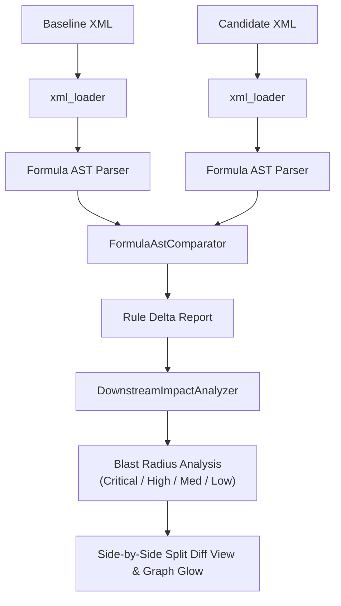
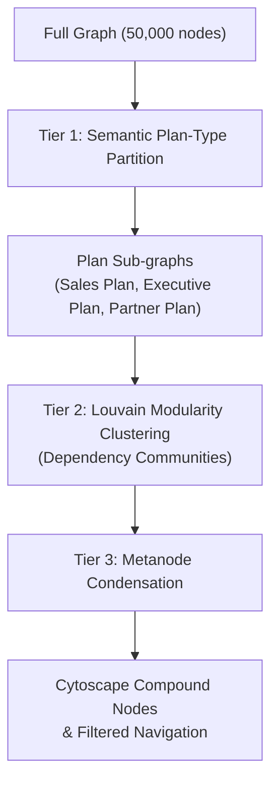
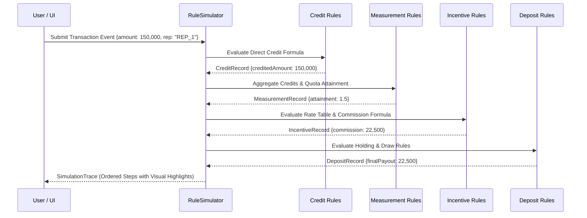

# SAP-IM-Config-Explorer Next-Generation Architecture & Implementation Plan

**Repository**: `F:\projects\Commissions\SAP-IM-Config-Explorer`  
**Package**: `sap_im_config_graph_explorer`  
**Target Architecture**: Next-Generation Core Enhancements (Phases 7+)  
**Jules Automation Issues**: #117, #118, #119, #120  
**Status**: Ready for Agent Dispatch (`ready-for-agent`, `state:ready`)  

---

## 1. Executive Summary & Architectural Invariants

SAP IM Config Explorer is an offline-capable, local-first workbench for analyzing, validating, visualizing, and simulating SAP Incentive Management (Commissions) XML configuration exports. The system operates strictly within the workstation boundary without transmitting proprietary rule or compensation structures across external networks.

### Core Architectural Invariants
1. **Local-First Processing**: All parsing, graph construction, diffing, simulation, and export serialization occur locally in the user's Python process and browser.
2. **Strict Graph Node Allowlist**: Graph nodes are strictly limited to the 17 approved domain object types (`FixedValue`, `Formula`, `LookupTable`, `Quota`, `RateTable`, `Territory`, `Variable`, `Rule`, `Plan`, `PlanComponent`, `EventType`, `CreditType`, `EarningCode`, `EarningGroup`, `BusinessUnit`, `ProcessingUnit`, `Calendar`). No unknown XML element may become a graph node.
3. **Snapshot-Scoped Reference Resolution**: References resolve strictly within a single snapshot; production and non-production namespaces cannot cross-satisfy references.
4. **No Inferred/Placeholder Nodes**: Broken or missing references produce structured `ValidationFinding` records (`missing_reference`, `ambiguous_reference`); they never generate fake graph nodes or dangling edges.
5. **Separation of Rule Internals**: Formula math operations, conditions, actions, literals, and parameter lists remain structured metadata or AST evidence rather than discrete graph nodes.
6. **Zero-Allocation / Low-Overhead Performance**: Graph algorithms operating on massive rule networks (5,000 to 50,000+ nodes) must use compact integer indexing and cache-friendly data structures to guarantee responsiveness.

---

## 2. Deep Architectural Review of the Current System

### 2.1 Package & Module Layout
The Python package `sap_im_config_graph_explorer` is organized into focused, single-responsibility modules:

```text
sap_im_config_graph_explorer/
├── __init__.py               # Package metadata and versioning
├── __main__.py               # CLI entrypoint runner
├── ai_provider.py            # Local-first AI summary provider (optional LLM integration)
├── app.py                    # FastAPI/Starlette REST backend and static server
├── cli.py                    # CLI batch folder validation and deterministic report generator
├── comparator.py             # XML configuration comparison engine
├── graph_builder.py          # Allowlisted graph construction and snapshot coordinator
├── graph_import.py           # Lossless Graph JSON schema validator and migrator
├── migration.py              # Migration risk scoring engine (HANA/Cloud readiness)
├── models.py                 # Core domain models, GraphDocument schema, and Pydantic validators
├── object_extractors/        # Extractor registry and XML element candidate builders
│   ├── base.py               # ExtractionContext and ObjectCandidate interfaces
│   ├── common.py             # XML tag normalization and reference heuristics
│   ├── formula.py            # Formula expression tag and attribute extractor
│   ├── node_factory.py       # Allowlist enforcer and stable node ID generator
│   ├── plans.py              # Plan and PlanComponent hierarchy extractors
│   ├── registry.py           # ExtractorRegistry catalog
│   └── rules.py              # Credit, Measurement, Incentive, Deposit rule extractors
├── pipeline.py               # Pipeline calculation flow stage classifier (Allocate to Payment)
├── portable_exports.py       # Deterministic CSV ZIP, Markdown, GraphML, and Neo4j bundle serializers
├── reference_resolver.py     # Deterministic reference resolution pass
├── static/                   # Static browser assets
│   ├── app.js                # Core UI application, Cytoscape controller, filter manager
│   ├── styles.css            # Dark/light theme responsive CSS
│   └── vendor/               # Vendored offline JS (cytoscape.min.js, 3d-force-graph.min.js)
├── templates/                # Jinja2 HTML templates
│   └── index.html            # Main multi-view single-page application layout
├── temporal.py               # Effective-date as-of view and temporal versioning
├── validation.py             # Validation pass (duplicate, unused, orphaned, missing)
├── xml_loader.py             # Secure XML parser (defusedxml, encoding matrix, BOM detection)
└── xml_to_html_converter.py  # Legacy XML-to-HTML rule specification converter
```

### 2.2 Subsystem Review Findings

#### XML Parser & Loader (`xml_loader.py`, `object_extractors/`)
- **Strengths**: Built on `defusedxml` to completely neutralize XML External Entity (XXE) and billion-laughs attacks. Robust multi-encoding detection (`utf-8`, `utf-16-le`, `utf-16-be`) with strict BOM validation and UTF-32 rejection.
- **Current Limitation**: Formula and Rule internal logic (conditions, calculations, math operations) are captured as flat tag lists (`expressionTags`) or raw XML strings (`rawXml`). There is no AST representation for semantic formula diffing or dynamic simulation.

#### Graph Builder & Reference Resolution (`graph_builder.py`, `reference_resolver.py`)
- **Strengths**: Deterministic node ID generation (`node-{type}-{hash}`) and canonical key normalization. Two strict topology modes: `core` (Plan, Component, Rule) and `full` (all 17 types). Strict snapshot boundaries prevent cross-environment pollution.
- **Current Limitation**: Graph layout and navigation operate on the complete set of nodes simultaneously. Large exports (5,000+ nodes) cause visual congestion ("hairball effect") and DOM/WebGL slowdowns without modular partitioning.

#### Comparison Engine (`comparator.py`)
- **Strengths**: Compares two XML configuration baselines (`baseline` vs `candidate`) across attributes, effective dates, descriptions, containment links, and reference targets.
- **Current Limitation**: When a formula or rule is modified, diffing only checks top-level attributes and references. It does not inspect formula expression syntax trees, mathematical operations, or rate table references. Furthermore, it does not calculate the *downstream blast radius* (which plans, components, and subsequent pipeline rules are impacted by the change).

#### Pipeline Flow Engine (`pipeline.py`)
- **Strengths**: Deterministically classifies rules into standard SAP IM calculation stages: `Allocate` (Rank 1), `Credit` (Rank 2), `Primary Measurement` (Rank 3), `Secondary Measurement` (Rank 4), `Incentive` (Rank 5), `Deposit` (Rank 6), and `Payment` (Rank 7).
- **Current Limitation**: Purely static structural analysis. It cannot simulate transactional credit inputs or trace numerical compensation values through the stages.

#### Portable Exports (`portable_exports.py`)
- **Strengths**: Deterministic, byte-stable serializers for CSV ZIP, Markdown, GraphML, and Neo4j bundles. Formula injection protection (`=`, `+`, `-`, `@` neutralization) and sorting by `(snapshotId, type, canonicalKey, id)`.
- **Current Limitation**: Lacks direct Cytoscape.js JSON export, Gephi GEXF format (widely used in enterprise network topology audits), and interactive standalone SVG vector files with embedded offline pan/zoom.

---

## 3. Design of Next-Generation Core Enhancements

### 3.1 Feature 1: Rule Delta & Version Comparison Engine (Issue #117)

#### Objective
Provide deep structural formula AST diffing between baseline and candidate configurations, paired with transitive downstream dependency blast radius analysis.

#### Architecture & Data Flow


#### Formula AST Schema
Formulas in SAP IM contain nested expressions, operators, and references:
```xml
<FORMULA NAME="Commission_Calc">
    <EXPRESSION>
        <MATH_OPERATION TYPE="MULTIPLY">
            <LOOKUP_TABLE_REF NAME="Attainment_Rates" FIELD="RATE"/>
            <VARIABLE_REF NAME="Eligible_Sales"/>
        </MATH_OPERATION>
    </EXPRESSION>
</FORMULA>
```
The new AST parser in `sap_im_config_graph_explorer/rule_delta.py` normalizes this into a recursive dataclass structure:
```python
@dataclass(frozen=True)
class FormulaExprNode:
    node_type: str  # "MATH_OPERATION", "FUNCTION", "LOOKUP_TABLE_REF", "VARIABLE_REF", "LITERAL"
    value: str | None = None
    operator: str | None = None
    children: tuple[FormulaExprNode, ...] = ()
    attributes: tuple[tuple[str, str], ...] = ()
```

#### Blast Radius Calculation
For any altered node $u \in \Delta$:
1. Outbound semantic dependency edges: $\{v \mid (v, u) \in E_{\text{uses}}\}$ (nodes that use $u$).
2. Upward containment hierarchy: $\{v \mid (u, v) \in E_{\text{belongs\_to}}\}$ (PlanComponents, Plans).
3. Pipeline forward feeding: $\{v \mid \text{Stage}(v) > \text{Stage}(u) \land \text{Connected}(u, v)\}$.
4. Blast radius score:
   $$\text{Score}(u) = w_{\text{plan}} \cdot N_{\text{plans}} + w_{\text{rule}} \cdot N_{\text{rules}} + w_{\text{deposit}} \cdot N_{\text{deposit\_rules}}$$

#### API Contract
`POST /api/compare` response extension:
```json
{
  "ok": true,
  "summary": { ... },
  "changed": [
    {
      "type": "Rule",
      "label": "Direct Sales Commission",
      "canonicalKey": "rule:direct_sales_commission",
      "formulaDifferences": [
        {
          "formulaName": "Commission_Calc",
          "changeType": "operator_modified",
          "baselineExpression": "MULTIPLY(Lookup(Attainment_Rates), Eligible_Sales)",
          "candidateExpression": "MULTIPLY(Lookup(Accelerated_Rates), Eligible_Sales)",
          "detail": "Lookup table reference changed from 'Attainment_Rates' to 'Accelerated_Rates'"
        }
      ],
      "blastRadius": {
        "severity": "high",
        "score": 42.5,
        "impactedNodes": [
          {"id": "node-plan-1", "type": "Plan", "label": "Enterprise Direct 2026"},
          {"id": "node-pc-2", "type": "PlanComponent", "label": "Software Incentives"},
          {"id": "node-rule-8", "type": "Rule", "label": "Q1 Detail Deposit"}
        ]
      }
    }
  ]
}
```

---

### 3.2 Feature 2: High-Performance Graph Partitioning & Plan-Type Clustering (Issue #118)

#### Objective
Declutter massive rule networks into navigable, hierarchical sub-graphs using semantic Plan-type grouping and zero-allocation Louvain modularity optimization.

#### Multi-Tier Clustering Strategy


#### Louvain Algorithm Implementation Constraints
- **Zero-Allocation Graph Arrays**: Instead of allocating Python dictionary objects during modularity optimization passes, nodes are indexed into contiguous integer arrays:
  ```python
  degrees = array('i', [0] * n_nodes)
  node_community = array('i', list(range(n_nodes)))
  community_weights = array('f', [0.0] * n_nodes)
  ```
- Modularity maximization:
  $$\Delta Q = \left[\frac{k_{i,\text{in}} + 2 k_{i,i}}{2m} - \left(\frac{\Sigma_{\text{tot}} + k_i}{2m}\right)^2\right] - \left[\frac{k_{i,\text{in}}}{2m} - \left(\frac{\Sigma_{\text{tot}}}{2m}\right)^2 - \left(\frac{k_i}{2m}\right)^2\right]$$
- Target performance: Execution time under 200ms for 10,000 nodes, zero C extension dependencies to preserve 100% offline Windows portability.

#### Condensed Metanodes
When clustering is enabled, dense sub-graphs can be collapsed into single metanodes:
```json
{
  "id": "cluster-metanode-sales-tier",
  "type": "ClusterMetanode",
  "label": "Direct Sales Plan Community (248 nodes)",
  "canonicalKey": "cluster:sales_tier_1",
  "metadata": {
    "isMetanode": true,
    "internalNodeCount": 248,
    "planType": "DirectSales",
    "memberNodeIds": ["node-rule-1", "node-formula-4", ...]
  }
}
```

---

### 3.3 Feature 3: Interactive Compensation Rule Simulator (Issue #119)

#### Objective
Allow users to inject simulated transaction/credit events and visually trace value propagation step-by-step through the calculation pipeline (`Credit -> Measurement -> Incentive -> Deposit`).

#### Execution Pipeline


#### Safe Expression Tree Evaluator
To prevent arbitrary code execution, formula expressions are evaluated using a strict AST interpreter supporting:
- Mathematical operators: `ADD`, `SUBTRACT`, `MULTIPLY`, `DIVIDE`, `MODULO`, `POWER`
- Built-in functions: `MIN`, `MAX`, `ROUND`, `ABS`, `IF`, `COALESCE`
- Rate Table lookup simulation: Step-tier interpolation and exact key matching
- Execution budget: Hard limit of 1,000 evaluation steps and recursion depth limit of 32 to guarantee termination.

#### API Contract
`POST /api/simulator/run`
Payload:
```json
{
  "event": {
    "eventType": "DirectSale",
    "amount": 150000.0,
    "participant": "REP_001",
    "period": "2026-01",
    "quota": 100000.0
  },
  "startingRuleId": null
}
```
Response:
```json
{
  "ok": true,
  "status": "success",
  "steps": [
    {
      "stepIndex": 1,
      "stage": "credit",
      "nodeId": "node-rule-credit-direct",
      "ruleName": "Direct Transaction Credit",
      "formula": "Transaction_Amount * Credit_Split",
      "inputs": {"Transaction_Amount": 150000.0, "Credit_Split": 1.0},
      "output": 150000.0,
      "outboundLinkIds": ["link-credit-to-meas"]
    },
    {
      "stepIndex": 2,
      "stage": "primary_measurement",
      "nodeId": "node-rule-meas-attainment",
      "ruleName": "Quota Attainment Measurement",
      "formula": "Credited_Amount / Quota",
      "inputs": {"Credited_Amount": 150000.0, "Quota": 100000.0},
      "output": 1.5,
      "outboundLinkIds": ["link-meas-to-inc"]
    },
    {
      "stepIndex": 3,
      "stage": "incentive",
      "nodeId": "node-rule-inc-commission",
      "ruleName": "Commission Calculation",
      "formula": "Lookup(Rate_Table, 1.5) * Credited_Amount",
      "inputs": {"Attainment": 1.5, "LookupRate": 0.15, "Credited_Amount": 150000.0},
      "output": 22500.0,
      "outboundLinkIds": ["link-inc-to-dep"]
    },
    {
      "stepIndex": 4,
      "stage": "deposit",
      "nodeId": "node-rule-dep-standard",
      "ruleName": "Monthly Deposit",
      "formula": "Incentive_Earnings",
      "inputs": {"Incentive_Earnings": 22500.0},
      "output": 22500.0,
      "outboundLinkIds": []
    }
  ],
  "finalDeposit": 22500.0
}
```

---

### 3.4 Feature 4: Multi-Format Topology Exporter (Issue #120)

#### Objective
Provide first-class serializers for Cytoscape.js JSON, Gephi GEXF 1.2, and standalone interactive SVG documents.

#### Serializer Formats & Specifications
1. **Cytoscape.js JSON** (`serialize_cytoscape_json`):
   - Conforms to standard `{ "elements": { "nodes": [...], "edges": [...] } }`.
   - Node data: `id`, `name` (label), `type`, `canonicalKey`, `snapshotId`, `metadata`.
   - Preserves 2D layout coordinates $(x, y)$ when layout positions are provided.
2. **Gephi GEXF 1.2** (`serialize_gexf`):
   - XML schema `http://www.gexf.net/1.2draft`.
   - Strongly typed `<attributes class="node">` (string, float, integer).
   - Visual attributes (`<viz:color r="g" b="a" />`, `<viz:size value="N" />`, `<viz:shape />`) mapped deterministically from node types (e.g. Plan = blue hexagon, Rule = emerald rectangle, Formula = violet ellipse).
   - Supports hierarchical grouping via `<node id="..." pid="...">` for PlanComponent and Plan parent-child relationships.
3. **Interactive Standalone SVG** (`serialize_standalone_svg`):
   - High-fidelity vector graphics file with embedded SVG `<style>` definitions.
   - Embedded standalone `<script>` implementing:
     - Pure vector pan and zoom (wheel and drag).
     - Hover tooltips showing object type, canonical key, and metadata.
     - Click-to-highlight connected upstream/downstream edges.
   - Completely standalone: requires no server, no external CDN assets, zero external script files.

---

## 4. Jules Automation & CI/CD Mapping

### 4.1 Jules Dispatch Requirements (`jules-dispatch.yml`)
Jules is the automated implementation agent for this repository. The dispatcher imposes strict intake criteria:

| Requirement | Implementation Policy |
| :--- | :--- |
| **Required Headings** | Every Issue body must include `## Goal`, `## Scope`, and `## Acceptance criteria`. |
| **Area Isolation** | Exactly **one** `area:*` label per issue (`area:xml-parser`, `area:graph-model`, `area:web-ui`, `area:html-output`). No two active issues may share an area. |
| **Risk Classification** | Exactly **one** `risk:*` label (`risk:low`, `risk:medium`, `risk:high`). Medium/Low are auto-merge eligible upon CI pass. |
| **Triage State** | `state:ready`, `ready-for-agent`, `agent:jules`. |
| **Concurrency Cap** | Maximum 2 active issues dispatched concurrently. |

### 4.2 Test & Validation Matrix
Every pull request generated by Jules must pass the full local validation suite:

```powershell
# Set bytecode suppression
$env:PYTHONDONTWRITEBYTECODE='1'

# Full CI validation
.\.venv\Scripts\python scripts\validate.py --mode full
```

The validation suite executes:
1. `pytest -q -p no:cacheprovider --basetemp .validation-output/pytest-temp` (All 274 unit/integration tests).
2. `node --check sap_im_config_graph_explorer/static/app.js` (JavaScript syntax validation).
3. `python sap_im_transformer.py tests/fixtures/minimal_plan.xml ... --variant=A` (Legacy HTML converter check).
4. `npm ci && npm run test:e2e` (All 22 Playwright end-to-end browser specifications).
5. GitHub Actions: `CodeQL` analysis, `dependency-review`, and `ci.yml`.

### 4.3 Sequential Merge & Post-Merge Hooks
- Auto-merge via `jules-sequential-merge` concurrency group.
- After merge: `jules-post-merge.yml` triggers, closes the linked issue, applies `state:done`, safely deletes the branch, and dispatches the next eligible issue from the queue.

---

## 5. GitHub Issue Registry & Implementation Roadmap

The four core enhancements have been created in GitHub Issues and are fully ready for Jules dispatch:

| Issue # | Area | Risk | Title | Dependencies |
| :---: | :--- | :---: | :--- | :---: |
| **#117** | `area:xml-parser` | `risk:medium` | `[Compare] Rule Delta & Version Comparison Engine with Formula AST Diffing and Blast Radius Analysis` | None (independent) |
| **#118** | `area:graph-model` | `risk:medium` | `[Graph] High-Performance Graph Partitioning and Plan-Type Multi-Tier Clustering` | None (independent) |
| **#119** | `area:web-ui` | `risk:medium` | `[Simulator] Interactive Compensation Rule Simulator with Event Propagation and Graph Animation` | Built on `pipeline.py` |
| **#120** | `area:html-output` | `risk:low` | `[Export] Multi-Format Topology Exporter for Cytoscape.js JSON, Gephi GEXF, and Standalone Interactive SVG` | None (independent) |

### Dispatch Sequencing
Because each of the four issues carries a distinct `area:*` label:
1. **Batch 1 Concurrent Dispatch**:
   - Issue **#117** (`area:xml-parser`)
   - Issue **#118** (`area:graph-model`)
2. **Batch 2 Dispatch** (upon Batch 1 merge):
   - Issue **#119** (`area:web-ui`)
   - Issue **#120** (`area:html-output`)

---

## 6. Verification & Definition of Done

Each enhancement pull request must meet the following Definition of Done:
- [ ] 100% adherence to Issue acceptance criteria.
- [ ] No modification to existing core invariants (strict node allowlist, local-first processing, snapshot reference boundaries).
- [ ] Unit test coverage with isolated regression suites under `tests/`.
- [ ] Browser E2E Playwright test coverage for interactive views and controls under `tests/e2e/`.
- [ ] Zero lint, syntax, or typing errors (`node --check`, `pyright` / `mypy`).
- [ ] Clean Windows execution and offline package compatibility verified.
